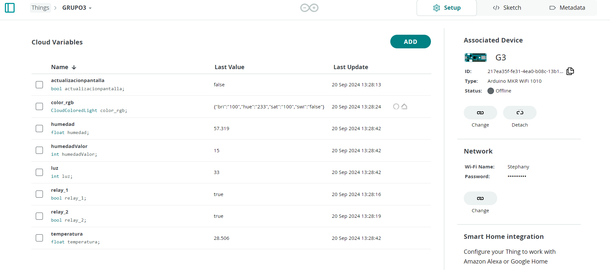
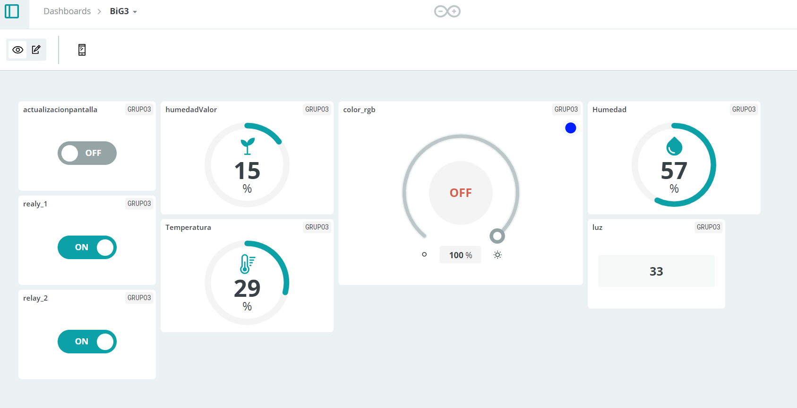

  
  <h1 align="center">Informe IV</h1>

 
<strong>Docentes:</strong>
- Mg. Umbert Lewis De La Cruz Rodriguez 
- Mg. Marcos Retamozo Ramos
- Mg. Moises Stevend Meza Rodriguez
- Mg. Carol Ordoñez Aquino
- Dr. Harry Anderson Rivera Tito  
- Dr. Pierre Ramos Apestegui 
- Ing. Renzo José Chan Ríos

<strong>Integrantes:</strong>
- Gavidia Crovetto, Bruno Paolo
- Silva Cuzqui, Camilo Sebastián
- Cueva Ramos, José Nilson
- Toribio Alvarado, Stephany Marilyn
- Herrera Valeriano, Jhunior Fernando 

  <h1 align="center">IoT</h1>

## Introducción
El internet de las Cosas (IoT) surgió como una respuesta a la necesidad de un control inmediato sobre los objetos de nuestro alrededor a través de conexiones de red. En este sentido, las útimas tecnologías que desarrolladas por IoT incluyen el desarrollo de diversos nodos inalámbricos equipados con sensores para ser utilizados en áreas como la industria, la salud, las ciudades inteligentes y la agricultura inteligente [1].

En los últimos años, la agricultura inteligente en los países desarrollados ha crecido exponencialmente gracias a la introducción del Internet de las Cosas para automatizar el trabajo agrícola. Este crecimiento está impulsado en gran medida por la capacidad del IoT para recopilar y analizar la información [2].

Este trabajo grupal consistió en convertir el **MKR IoT Carrier** en un dispositivo agrícola urbano. Se utilizaron sensores para monitorear el ambiente de una planta y relés para controlar dispositivos de alta potencia. El objetivo fue crear un entorno ideal y controlado para el crecimiento de la planta, utilizando **Arduino Cloud** para la visualización y control remoto de los datos.

## Objetivos de Aprendizaje
- Configuración de un entorno agrícola urbano.
- Entender cómo funcionan los relés y el sensor de humedad.
- Crear un ambiente adecuado para una planta.

## Componentes Utilizados
- **Arduino MKR WiFi 1010**: Controlador principal.
- **MKR IoT Carrier**: Sensores para monitorear el ambiente.
- **Sensor de humedad**: Mide la humedad del suelo.
- **Relés**: Activan dispositivos de alta potencia.
- **Cable Micro USB**: Para alimentación y programación.

## Creación del Panel de Control
En primer lugar, se creó un panel de control en **Arduino Cloud** con los siguientes widgets:

| Variable             | Widget         | Rango       |
|----------------------|----------------|-------------|
| humedad              | Porcentaje     | 0 - 100     |
| temperatura          | Indicador      | -40 - 100   |
| luz                  | Valor          | n/a         |
| humedadValor         | Porcentaje     | 0 - 100     |
| relé_1, relé_2       | Switch         | n/a         |
| rgbColor             | Luz coloreada  | n/a         |
| actualizaciónPantalla| Switch         | n/a         |

### Thing
Posteriormente, se colocó estos parámetros en un thing

FUENTE: Figura 1. THING Arduino Cloud

El panel permite monitorear y controlar variables como la temperatura, humedad, luz, y activar dispositivos como luces mediante los relés.

FUENTE: Figura 2. Dashboard Arduino Cloud

## Monitorización y Control
El panel cuenta con cuatro widgets para monitoreo de sensores como humedad y temperatura, y cuatro widgets para control, permitiendo activar los relés y ajustar las luces. Esto permite mantener condiciones ideales para la planta (ejemplo: aloe vera), controlando el sistema de manera remota.

FUENTE: Figura 3. Elaboración Propia

FUENTE: Figura 4. Elaboración Propia

A continuación el [código](https://github.com/stephany-toribio/ProyectosDeIngenieria1/blob/main/Laboratorios/Lab4/Sketch.c).

## Video del funcionamiento del el DashBoard, Sensor de Humedad en la tierra & humedad del Ambiente
https://github.com/user-attachments/assets/153e67ca-1442-43d6-9dee-e5ad4aee72ba

## Video del funcionamiento del las Luces RGB , sensor de luz y funcionamiento del los Relé
https://github.com/user-attachments/assets/fe6c3902-3731-4b86-9c52-435665b9c664

## Discusión
Los resultados obtenidos indican que se conectó exitosamente el Arduino MKR IoT Carrier a la plataforma IoT, en el que los sensores respondieron adecuadamente a los comandos enviados desde la nube. No obstante, se observaron pequeños retrasos en las respuestas y algunos problemas en cuanto a la conectividad y el limite de dispositivos conectados.

## Referencias Bibliográficas

[1] Unirioja.es. [En línea]. Disponible en: https://dialnet.unirioja.es/servlet/articulo?codigo=7210369. [Consultado: 23-sep-2024].

[2] E. Pagliari, L. Davoli, y G. Ferrari, “Harnessing communication heterogeneity: Architectural design, analytical modeling, and performance evaluation of an IoT multi-interface gateway”, IEEE Internet Things J., vol. 11, núm. 5, pp. 8030–8051, 2024. 
